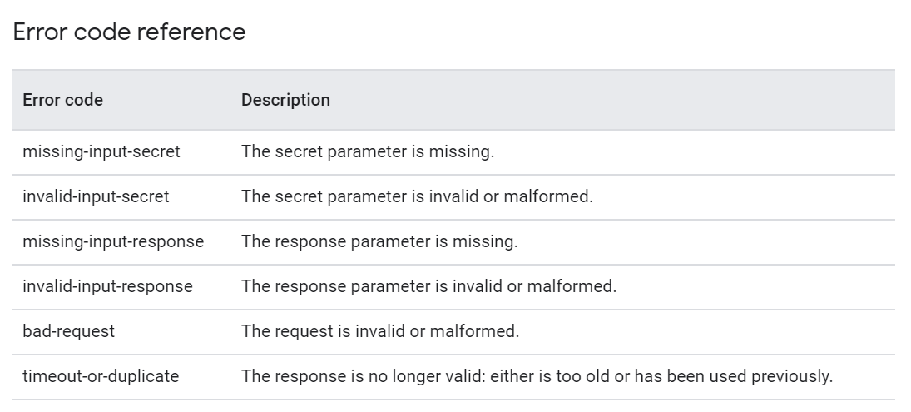
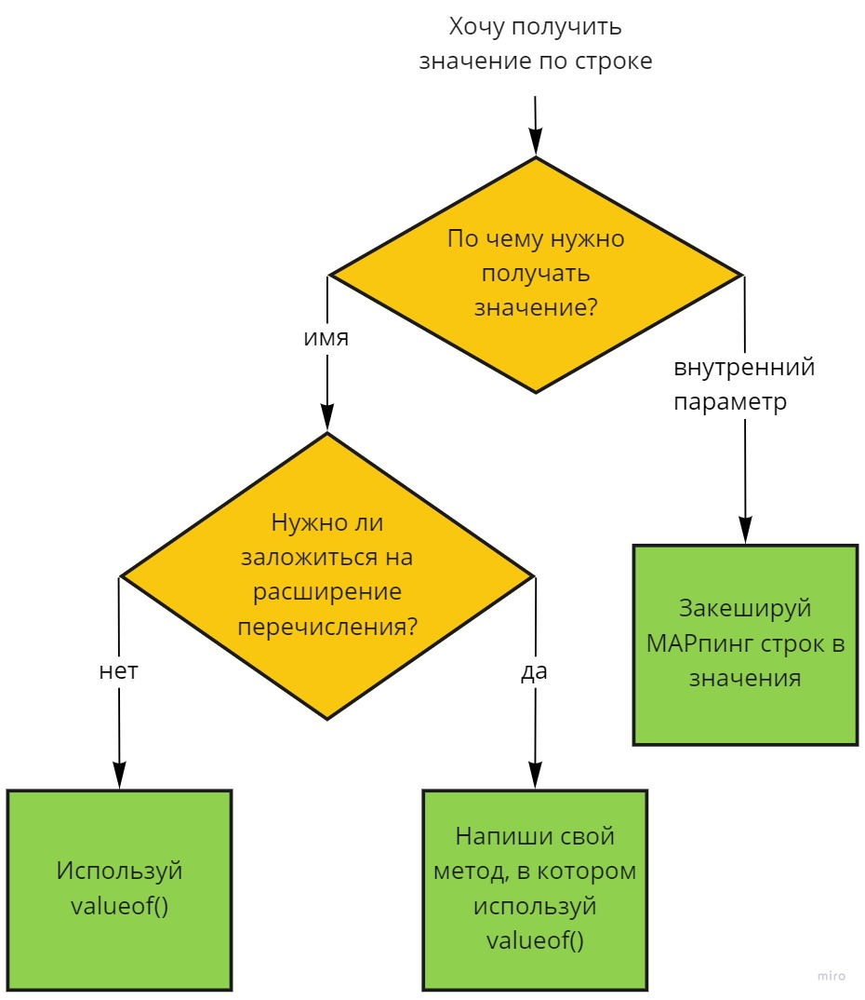

# Effective enums

Содержание:
- [Введение](talk_intro.md)
- Перечисления в публичном API
  - JSON
  - Генерация Open API
- Перечисления в БД
  - Маппинг перечисления в БД с помощью `@Enumerated`
  - Маппинг перечисления в БД с помощью `AttributeConverter`
- Получение перечисления по значению
  - Сравнение перфоманса
- Разделение слоев
- Перечисление как Singleton
  - Pure Java Enum Singleton
  - Enum Singleton как Spring Bean
  - Что там у Котлинистов?
- Внутреннее перечисление как способ организации бизнес-логики
- Использование перечислений в тестах
  - Проход по значениям перечисления
  - Генерация тестовых моделей
- Выводы

## Перечисления в публичном API
По поводу использования перечислений в публичном API сломано немало копий.
Например, на последнем JPoint был [доклад][enums-in-api-jpoint], осуждающий использование перечислений в API в большинстве случаев.

При рассмотрении использования перечислений в публичном API нужно разделять получение и отдачу перечислений.
Отдавать перечисления - хорошо. 
Клиенты вашего API будут рады, что часть полей может принимать только ограниченное количество значений.
Это позволяет клиентам заложить различную логику обработки приходящих значений.
Коды состояния http и MIME-типы тоже являются примерами перечислений в API.

Принимать перечисления - тоже хорошо (но уже не так сильно).
Когда вы выступаете в качестве клиента чужого API или принимаете значения от пользователя, нужно провести анализ: каким образом обрабатывать входящие значения.
То, что поле имеет строго определенный перечень возможных значений, еще не значит, что вы обязательно должны использовать перечисление.
Я считаю, что если логика вашего приложения не разветвляется в зависимости от значения перечисления, то вполне можно использовать для передачи и хранения поля обычные строки.
В любом ином случае лучше использовать перечисления, при этом всегда стоит перестраховаться на получение неожиданных значений.

Рассмотрим в качестве примера интеграцию с Google ReCaptcha.
В официальной документации написано, что API может возвращать список ошибок, часть из которых является восстанавливаемыми, а часть нет.
Список возможных ошибок приведен на картинке:



Логика обработки ответа будет зависеть от конкретного типа ошибки, поэтому мы используем перечисление:
```java
@RequiredArgsConstructor
public enum ErrorCode {
    MISSING_INPUT_SECRET("missing-input-secret"),
    INVALID_INPUT_SECRET("invalid-input-secret"),
    MISSING_INPUT_RESPONSE("missing-input-response"),
    INVALID_INPUT_RESPONSE("invalid-input-response"),
    BAD_REQUEST("bad-request"),
    TIMEOUT_OR_DUPLICATE("timeout-or-duplicate");

    private final String value;

    public static final EnumSet<ErrorCode> RECOVERABLE_ERRORS = EnumSet.of(
            MISSING_INPUT_RESPONSE,
            INVALID_INPUT_RESPONSE,
            TIMEOUT_OR_DUPLICATE
    );
}
```
Для того чтобы заложить логику обработки ошибок, мы даже создали множество восстанавливаемых ошибок.

Но вот беда, когда мы начали тестировать интеграцию с сервисом Google ReCaptcha, оказалось, что у него есть незадокументированное поведение.
В ряде случаев их API возвращает в коде ошибки значение `invalid-keys`.
Худшее, что можно сделать в этой ситуации - ограничиться добавлением нового значения `INVALID_KEYS` в перечисление.
```java
@RequiredArgsConstructor
public enum ErrorCode {
    MISSING_INPUT_SECRET("missing-input-secret"),
    INVALID_INPUT_SECRET("invalid-input-secret"),
    MISSING_INPUT_RESPONSE("missing-input-response"),
    INVALID_INPUT_RESPONSE("invalid-input-response"),
    BAD_REQUEST("bad-request"),
    TIMEOUT_OR_DUPLICATE("timeout-or-duplicate"),
    INVALID_KEYS("invalid-keys");

    private final String value;
}
```

Возможно это не единственное незадокументированное значение, а другие просто не были обнаружены при тестировании.

Что же делать?
На мой взгляд, лучшее решение - создать отдельное перечисление для всех незадокументированных значений.
При парсинге входящей строки любое незнакомое значение будет преобразовано в специальное перечисление.
Обработка этого перечисления будет реализована в сервисе, ответственном за обработку ответа от внешнего сервиса.
```java
@RequiredArgsConstructor
public enum ErrorCode {
    MISSING_INPUT_SECRET("missing-input-secret"),
    INVALID_INPUT_SECRET("invalid-input-secret"),
    MISSING_INPUT_RESPONSE("missing-input-response"),
    INVALID_INPUT_RESPONSE("invalid-input-response"),
    BAD_REQUEST("bad-request"),
    TIMEOUT_OR_DUPLICATE("timeout-or-duplicate"),
    INVALID_KEYS("invalid-keys"),
    UNEXPECTED("unexpected");

    private final String value;
}
```

Сейчас я умышленно не показываю каким образом происходит преобразование строки в перечисление. 
Этому посвящен отдельный раздел чуть ниже.

А теперь рассмотрим какие существуют инструменты для преобразования перечислений в различные форматы представления данных и обратно.

### JSON
К сожалению, в синтаксисе JSON нет возможности выделить перечисления, поэтому приходится передавать значение enum в виде строки или целого числа.
Но это не повод не использовать перечисления в Java коде.
Если вы используете Jackson для сериализации в JSON, то он прекрасно справляется с преобразованием перечислений в строки.
```java
@Test
void serializeEnum() throws JsonProcessingException {
    String day = objectMapper.writeValueAsString(DayOfWeek.MONDAY);
    assertEquals("\"MONDAY\"", day);
}
```
И в обратную сторону:
```java
@Test
void deserializeEnum() throws JsonProcessingException {
    DayOfWeek day = objectMapper.readValue("\"MONDAY\"", DayOfWeek.class);
    assertEquals(DayOfWeek.MONDAY, day);
}
```

#### Почему ваш JSON на меня орет?

При интеграции с каким-либо сервисом перечисления в его API могут быть заданы с помощью магических чисел или непривычным для Java кодстайла способом.
Например, в [API Яндекс.Маркета][yandex-api] статусы задаются в числовом виде, а в [API Google ReCaptcha][recaptcha-api] коды ошибок задаются в кебаб-кейсе.
В своем коде же мы хотели бы видеть эти значения в виде перечислений.

Для перевода значения в перечисление можно было бы написать конвертер, но Jackson предоставляет более удобный способ.
Достаточно поставить над полем в вашем перечислении аннотацию `@JsonValue`.
```java
public enum Grade {
    EXCELLENT('A'),
    SATISFACTORY('B'),
    MEDIOCRE('C'),
    INSUFFICIENT('D'),
    FAILURE('F');
    
    @JsonValue
    private final char mark;
}
```
Теперь при сериализации такого перечисления в JSON он будет приведен к значению, помеченному `@JsonValue`.
```json
{
    "grade": "A"
}
```

То же работает и в обратную сторону: при парсинге JSON Jackson будет автоматически переводить строковое значение в перечисление.

Ранее мы разобрали, что при получении данных из внешних источников в большинстве случаев стоит закладывать отдельное перечисление для незадокументированных значений.
Поэтому при получении данных для парсинга лучше использовать статический метод генерации, помеченный аннотацией `@JsonCreator`:
```java
public enum ErrorCode {
    /* ... */
    @JsonCreator
    public static ErrorCode parse(String value) {
        return Arrays.stream(values())
            .filter(it -> it.getValue().equals(value))
            .findFirst()
            .orElse(ErrorCode.UNEXPECTED);
    }
}
```


```json
{
    "error-codes": [
        "invalid-keys",
        "timeout-or-duplicate"
    ]
}
```

### Генерация Open API
Все клиенты вашего API будут бесконечно благодарны, если в документации на API вы опишете все возможные значения перечисляемого поля. 
Многие openApi генераторы (я использую [springdoc][springdoc-github]), преобразующие DTO в openApi схему, умеют работать с перечислениями. 
Например, вот такой DTO
```java
public class Lesson {

    private String discipline;
    private DayOfWeek dayOfWeek;
    private int order;
    private String cabinet;
}
```

будет автоматически преобразован в 
```yaml
Lesson:
  type: object
  properties:
    discipline:
      type: string
    dayOfWeek:
      type: string
      enum:
      - MONDAY
      - TUESDAY
      - WEDNESDAY
      - THURSDAY
      - FRIDAY
      - SATURDAY
      - SUNDAY
    order:
      type: integer
      format: int32
    cabinet:
      type: string
```


## Разделение слоев
<mark>todo</mark>

```yaml
Order:
  type: object
  properties:
    id:
      type: integer
      format: int64
    status:
      type: string
      enum:
      - APPROVAL_PENDING
      - CREATE_PENDING
      - CREATED
      - ASSEMBLING_PENDING
      - ASSEMBLING
      - ASSEMBLED
      - NOT_APPROVED
      - CANCEL_PENDING
      - CANCELLED
      - ERROR
      - REASON_SEARCHING
```


## Перечисления в БД
В данном разделе будет рассматриваться работа с перечислениями только с помощью JPA. 
Более низкоуровневые инструменты, такие как JDBC или Spring JdbcTemplates, не предоставляют никаких дополнительных возможностей по работе с перечислениями.

### Маппинг перечисления в БД с помощью `@Enumerated`
Предположим, у нас есть сущность, одно из полей которой может быть выражено в виде перечисления.
Пусть такой сущностью будет Город, а перечислением - Материк, на котором этот город расположен.
```java
@Entity
public class City {
    /* ... */

    private Continent continent;
    /* ... */
}
```

Для описания материков выберем модель, принятую в России, когда считается, что две Америки - это разные континенты, а Европа и Азия - один.
```java
public enum Continent {
    AFRICA,
    EURASIA,
    NORTH_AMERICA,
    SOUTH_AMERICA,
    ANTARCTICA,
    AUSTRALIA
}
```

Если задать поле перечисляемого типа в своей сущности, то JPA будет пытаться преобразовать его в число с помощью `ordinal()` и положить число в базу.
Думаю, не стоит объяснять, что хранение `ordinal()` в базе данных не выдержит проверку временем.
Чаще всего мы хотим хранить перечисление в БД в виде строки.
Для этого нужно над полем перечисляемого типа поставить аннотацию `@Enumerated` с параметром `EnumType.STRING`:
```java
@Entity
public class City {
    /* ... */

    @Enumerated(EnumType.STRING)
    private Continent continent;
    /* ... */
}
```
Теперь перечисления будут автоматически преобразовываться в свои строковые наименования и заботливо укладываться в БД.

Аннотацию `@Enumerated(EnumType.STRING)` можно использовать для тех перечислений, в неизменности которых мы уверены.
Количество континентов вряд ли поменяется в ближайшее время, поэтому мы можем использовать `@Enumerated` в данном случае.
Конечно, когда-нибудь тектонические плиты передвинутся и образуют новый континент.
Если в базе данных каким-то образом окажется новый континент `PANGEIA`, то наше приложение упадет с уродливым `IllegalArgumentException`:
```
java.lang.IllegalArgumentException: No enum constant dev.boiarshinov.enumsindb.db.City.Continent.PANGEIA

	at java.base/java.lang.Enum.valueOf(Enum.java:240)
	at org.hibernate.type.descriptor.java.EnumJavaTypeDescriptor.fromName(EnumJavaTypeDescriptor.java:84)
	at org.hibernate.type.descriptor.java.EnumJavaTypeDescriptor.wrap(EnumJavaTypeDescriptor.java:54)
	at org.hibernate.type.descriptor.java.EnumJavaTypeDescriptor.wrap(EnumJavaTypeDescriptor.java:16)
	at org.hibernate.type.descriptor.sql.VarcharTypeDescriptor$2.doExtract(VarcharTypeDescriptor.java:62)
	at org.hibernate.type.descriptor.sql.BasicExtractor.extract(BasicExtractor.java:47)
    // Стектрейс на 101 строку
```

Но это проблема программистов из далекого будущего.

### Маппинг перечисления в БД с помощью `AttributeConverter`
Гораздо ближе к нам проблема освоения солнечной системы.
Предположим, наше приложение ведет учет планетарных баз в нашей солнечной системе.
У каждой базы есть поле, указывающее на какой планете она расположена.
```java
@Entity
public class PlanetBase {
    /* ... */
  
    private SolarPlanet solarPlanet;
    /* ... */
}
```
Помните, как в 2006 году Плутон перестали считать полноценной планетой и перевели в карлики?
Что на уме у этих астрономов?
Кто следующий на очереди?
Меркурий?

Мы уже научены на опыте `ErrorCode`, что необходимо уметь обрабатывать неожиданные значения.
Поэтому, когда Плутон исчез из нашего приложения, мы завели вместо него специальное значение - `UNKNOWN_MIDGET`:
```java
public enum SolarPlanet {
    MERCURY,
    VENUS,
    EARTH,
    MARS,
    JUPITER,
    SATURN,
    URANUS,
    NEPTUNIUM,
    UNKNOWN_MIDGET
}
```

Мы хотим, чтобы все неизвестные приложению планеты вроде Плутона, Церера и прочие, не ломали наше приложение, а парсились в `UNKNOWN_MIDGET`.
Аннотация `@Enumerated` здесь уже не поможет.
Необходимо написать кастомный JPA конвертер.
Для этого необходимо унаследоваться от интерфейса `AttributeConverter` и поставить над классом аннотацию `@Converter`.
Теперь мы можем заложить любую логику обработки неожиданных значений: вернуть `UNKNOWN_MIDGET`, залогировать варнинг или кинуть кастомное исключение. 
```java
@Converter
public class SolarPlanetConverter
    implements AttributeConverter<SolarPlanet, String>
{
    @Override
    public String convertToDatabaseColumn(SolarPlanet planet) {
        return planet.name();
    }

    @Override
    public SolarPlanet convertToEntityAttribute(String planetName) {
        try {
            return SolarPlanet.valueOf(planetName);
        } catch (IllegalArgumentException ignored) {
            log.warn("Unknown planet '{}' was found while parsing data from db", planetName);
            return SolarPlanet.UNKNOWN_MIDGET;
        }
    }
}
```

А как же параметры в перечислениях, как в примере с `ErrorCode`?
Что если мы хотим хранить в базе данных значения в том виде, в котором они используются на уровне API? 
Не `MISSING_INPUT_SECRET`, а `missing-input-secret`.
Не `SATISFACTORY`, а `B`.
Для этого можно все так же использовать JPA `AttributeConverter`.
Но на деле вам не стоит использовать одни и те же перечисления в базе данных и в публичном API. 


## Получение перечисления по значению

В предыдущих разделах мы увидели, что при использовании перечислений постоянно приходится преобразовывать перечисления в строки и наоборот.
Если с прямым преобразованием все понятно - достаточно вызвать метод `name()` или дернуть нужный геттер, то с обратным не все так просто.

Здесь хотелось бы рассмотреть отдельно парсинг значения перечисления по названию этого значения и по отдельному полю.

### Получение перечисления по названию

На первый взгляд ответ кажется очевидным: нужно использовать метод `valueOf()`, существующий во всех перечислениях, и дело с концом.
```java
var continent = Continent.valueOf("AFRICA");
```
Здесь мы встречаемся с небольшой проблемой - метод `valueOf()` падает с `IllegalArgumentException` при попытке распарсить несуществующее значение.
Но в ряде случаев мы хотим, чтобы все несуществующие значения парсились в одно конкретное перечисление.
Для обработки таких ситуаций рождается следующий код:
```java
public static SolarPlanet valueOfOrDefault(String name) {
    try {
        return SolarPlanet.valueOf(name);
    } catch (IllegalArgumentException ignored) {
        return SolarPlanet.UNKNOWN_MIDGET;
    }
}
```

Ах, если бы `valueOf()` возвращал `Optional`!

Здесь нам на выручку приходят библиотеки Apache Commons и Guava.
В них есть утилитные классы `EnumUtils` и `Enums` соответственно, которые предоставляют различные удобства для работы с перечислениями.
В Guava есть метод, возвращающий `Optional`. Правда это Guav'овский `Optional`, поэтому выглядит немного непривычно:
```java
public static SolarPlanet valueOfOrDefault(String name){
    return Enums.getIfPresent(SolarPlanet.class, name)
        .or(SolarPlanet.UNKNOWN_MIDGET);
}
```

С использованием Apache Commons это будет выглядеть так:
```java
public static SolarPlanet valueOfOrDefault(String name){
    return EnumUtils.getEnum(SolarPlanet.class, name, SolarPlanet.UNKNOWN_MIDGET);
}
```

А есть ли разница между этими тремя подходами?
Ну и что с того, что самописная реализация получилась с наибольшим количеством строк, зато своя.
Но может быть разработчики Apache Commons или Guava учли какие-то подводные камни или их реализации намного более производительные?
Давайте заглянем внутрь.

Как уже отмечалось в начале доклада, реализация метода `valueOf()` в классе `Enum` нам неизвестна.
Дело в том, что она генерируется для каждого конкретного перечисления на этапе компиляции.
Но мы можем посмотреть на реализации в библиотеках и попробовать сравнить производительность.

Реализация Apache Commons написана в лоб и по сути повторяет нашу собственную:
```java
public static <E extends Enum<E>> E getEnum(
        final Class<E> enumClass, 
        final String enumName, 
        final E defaultEnum
) {
    if (enumName == null) {
        return defaultEnum;
    }
    try {
        return Enum.valueOf(enumClass, enumName);
    } catch (final IllegalArgumentException ex) {
        return defaultEnum;
    }
}
```
А вот реализация Guava уже интереснее: в утилитном классе `Enums` прячется кэш слабых ссылок, который заполняется при первом обращении к конкретному перечислению:
```java
private static final Map<Class<? extends Enum<?>>, Map<String, WeakReference<? extends Enum<?>>>>
      enumConstantCache = new WeakHashMap<>();

private static <T extends Enum<T>> 
    Map<String, WeakReference<? extends Enum<?>>> populateCache(Class<T> enumClass) 
{
    Map<String, WeakReference<? extends Enum<?>>> result = new HashMap<>();
    for (T enumInstance : EnumSet.allOf(enumClass)) {
      result.put(enumInstance.name(), new WeakReference<Enum<?>>(enumInstance));
    }
    enumConstantCache.put(enumClass, result);
    return result;
}
```
Кэш представляет собой мапу 'имя перечисления' - 'значение'.

А помните, в начале доклада я упоминал, что в классе `Enum` есть еще один метод `valueOf()` - статический?
Так вот его реализацию мы можем посмотреть и там внутри будет так же кэш в виде мапы:
```java
private transient volatile Map<String, T> enumConstantDirectory;

Map<String, T> enumConstantDirectory() {
    Map<String, T> directory = enumConstantDirectory;
    if (directory == null) {
        T[] universe = getEnumConstantsShared();
        if (universe == null)
            throw new IllegalArgumentException(
                getName() + " is not an enum type");
        directory = new HashMap<>((int)(universe.length / 0.75f) + 1);
        for (T constant : universe) {
            directory.put(((Enum<?>)constant).name(), constant);
        }
        enumConstantDirectory = directory;
    }
    return directory;
}
```

Возможно кэши будут отрабатывать быстрее родной реализации `valueOf()`.
Для того чтобы проверить это, я написал [бенчмарки с использованием JMH](/enums-performance/src/main/java/benchmarks/byname).
Сравнивалась производительность для различных размеров перечислений: с 5 и 100 значениями.
Бенчмарки гонялись на моем личном компьютере с процессором Intel Core i5-8400 и 16 ГБ оперативной памяти.
Результаты представлены ниже:

Для 5 элементов:
```
Benchmark                 Mode  Cnt   Score   Error  Units
Enum5Benchmark.apache     avgt    5   7,088 ± 0,101  ns/op
Enum5Benchmark.guava      avgt    5  12,538 ± 0,027  ns/op
Enum5Benchmark.valueOf    avgt    5   6,482 ± 0,027  ns/op
Enum5Benchmark.valueOf2   avgt    5   6,231 ± 0,041  ns/op
```

Для 100 элементов:
```
Benchmark                   Mode  Cnt   Score   Error  Units
Enum100Benchmark.apache     avgt    5   7,947 ± 1,008  ns/op
Enum100Benchmark.guava      avgt    5  13,271 ± 2,412  ns/op
Enum100Benchmark.valueOf    avgt    5   7,144 ± 0,822  ns/op
Enum100Benchmark.valueOf2   avgt    5   7,225 ± 0,874  ns/op
```
<mark>нарисовать графики</mark>

Как видно из результатов: Guava переиграла саму себя со своим оверинжинирингом, 
а Apach'евский `getEnum()` оказался чуть медленнее стандартных Jav'овых `valueOf()`.
Разница же в различных методах `valueOf()` незначительна и победа находится то на стороне статической реализации, 
то на стороне нестатической в зависимости от количества значений в перечислении.


### Получение перечисления по параметру

Теперь рассмотрим случай, когда нам необходимо получиться значение перечисления по параметру.
Для этого обратимся к рассмотренному ранее классу `ErrorCode`: 
```java
public enum ErrorCode {
    MISSING_INPUT_SECRET("missing-input-secret"),
    INVALID_INPUT_SECRET("invalid-input-secret"),
    MISSING_INPUT_RESPONSE("missing-input-response"),
    INVALID_INPUT_RESPONSE("invalid-input-response"),
    BAD_REQUEST("bad-request"),
    TIMEOUT_OR_DUPLICATE("timeout-or-duplicate"),
    INVALID_KEYS("invalid-keys"),
    UNEXPECTED("unexpected");
    
    private final String value;
}
```

В приведенном примере параметр перечисления почти полностью соответствует его значению: нужно только заменить дефисы на нижние подчеркивания и написать все капсом.
Но часто встречаются случаи, когда название перечисления разительно отличается от значения внутреннего параметра:
```java
public enum ResponseCode {
    SUCCESS("RC0000"),
    INVALID_RECAPTCHA("RC4001"),
    AGENT_NOT_FOUND("RC4002"),
    /* ... */
    ILLEGAL_INN("RC4053"),
    ERROR("RC9999");
    
    private final String code;
}
```
или
```java
public enum QrType {
    STATIC('S'),
    DYNAMIC('D'),
    SUBSCRIPTION('B');
    
    private final char mark;
}
```

Зачастую можно встретить подобный код:
```java
public static ErrorCode from(String value) {
  return Arrays.stream(values())
    .filter(it -> it.getValue().equals(value))
    .findFirst()
    .orElse(ErrorCode.UNEXPECTED);
}
```

Подобный подход имеет сложность O(N), заставляя каждый раз проходить по всем элементам перечисления, пока не встретится нужное значение.

Можно ли сделать это эффективнее?
Конечно, можно!
Предлагаю вам вспомнить те уроки, которые мы извлекли, изучая реализации `valueOf(Class, String)` и Guava `Enums.getIfPresent()`.
Хочешь улучшить производительность - наверни кэш в виде мапы!
Запишется это так:
```java
private static final Map<String, ErrorCode> VALUE_TO_ENUM = 
        EnumSet.allOf(ErrorCode.class).stream()
            .collect(Collectors.toMap(ErrorCode::getValue, Function.identity()));

public static ErrorCode parse(String value) {
    return Optional.ofNullable(VALUE_TO_ENUM.get(value))
        .orElse(ErrorCode.UNEXPECTED);
}
```

Таким образом при старте приложения (при первом обращении к перечислению) будет подготовлена таблица соответствия значений к перечислениям.
А получение перечисления по параметру будет иметь алгоритмическую сложность O(1).

Вопрос это не новый и не раз уже обсуждался на StackOverflow: [раз][so_enum_by_value_1], [два][so_enum_by_value_2].

Помимо алгоритмической сложности этот подход имеет еще одно преимущество.
Наличие мапы позволяет быстро отдавать множество всех значений.
```java
public static Set<String> getCodes() {
    return VALUE_TO_ENUM.keySet();
}
```

Множество это удобно использовать в валидаторах:
```java
public boolean isValid(String value, ConstraintValidatorContext context) {
    if (value == null) return true;
    
    return ErrorCode.getCodes().contains(value);
}
```

Но стоит ли овчинка выделки?
Для ответа на этот вопрос я вновь написал [бенчмарки с использованием JMH](/enums-performance/src/main/java/benchmarks/byvalue).
В них я рассмотрел три варианта: последовательный проход до первого совпадения в цикле, последовательный проход до первого совпадения в стриме и получение закешированного значения из внутренней мапы.
Результаты представлены ниже:

Для 5 элементов:
```
Benchmark                Mode  Cnt   Score   Error  Units
Enum5Benchmark.forLoop   avgt    5  13,730 ± 0,496  ns/op
Enum5Benchmark.mapCache  avgt    5   6,263 ± 0,613  ns/op
Enum5Benchmark.stream    avgt    5  67,962 ± 8,707  ns/op
```

Для 100 элементов:
```
Benchmark                  Mode  Cnt    Score     Error  Units
Enum100Benchmark.forLoop   avgt    5  219,239 ±   1,211  ns/op
Enum100Benchmark.mapCache  avgt    5    6,885 ±   0,394  ns/op
Enum100Benchmark.stream    avgt    5  678,155 ± 104,548  ns/op
```

Как видно из результатов: производительность варианта с кэшом почти не зависит от количества значений.
При этом производительность кэша по сравнению со стримом на порядок выше при небольшом количестве значений и на два порядка выше при большом количестве значений. 

По результатам проведенных измерений хочется дать следующие рекомендации:
- нужно получить значение перечисления по имени, а перечисление никогда не изменится - используй `valueOf()`;
- если оно может расширяться, то лучше обернуть `valueOf()` в try-catch блок;
- если же нужно получаться значение перечисления по параметру, то лучше всего навернуть внутри перечисления небольшой кэш.



## Перечисление как Singleton
Предлагаю опустить холивары на тему: является ли Singleton паттерном или антипаттерном.

### Pure Java Enum Singleton
Часто на собеседованиях спрашивают: как сделать потокобезопасный и ленивый Singleton?
При этом обычно ожидают ответ с блоками `synchronized` вроде такого:
```java
public class Singleton {
    private static volatile Singleton instance;
	
    public static Singleton getInstance() {
		Singleton localInstance = instance;
		if (localInstance == null) {
			synchronized (Singleton.class) {
				localInstance = instance;
				if (localInstance == null) {
					instance = localInstance = new Singleton();
				}
			}
		}
		return localInstance;
	}
}
```

Но есть гораздо более простой способ - перечисление.
```java
public enum EnumSingleton {
    INSTANCE
}
```

Создавать Singleton'ы таким способом нам советует Джошуа Блох в своей книге Effective Java:
> ... single-element enum type is often the best way to implement a singleton.

При создании такой синглтон точно потокобезопасен, ведь созданием экземпляра занимается `ClassLoader`.
Также Enum Singleton можно с некоторой натяжкой назвать ленивым.
Инстанс будет создан при первом обращении к классу.
Так что если в вашем перечислении есть статические методы, которые вы хотите вызвать до первого обращения к инстансу - ленивая инициализация станет не такой уж ленивой.
Но, мне кажется, что иметь статические методы или статические публичные поля в Singleton - странное решение. 
Не для того же он создавался как объект, чтобы использоваться, как утилитный класс.  

Перечисление может иметь мутируемое состояние.
Мы не привыкли к тому, чтобы хранить в перечислении какое-либо состояние, но такой код вполне допустим с точки зрения компилятора Java:
```java
public enum EnumSingleton {
    INSTANCE;

    private String mutableField = "Initial value";

    public void setMutableField(String mutableField) {
        this.mutableField = mutableField;
    }
}
```

### Enum Singleton как Spring Bean
Предположим, у вас развилась паранойя и вы боитесь, что какой-нибудь неопытный разработчик будет вручную создавать экземпляры спрингового бина со скоупом `singleton`, не зная о том, что это задача IoC контейнера.
И вы решили ограничить такую возможность с помощью перечисления.

Большинство спринговых бинов имеют зависимости от других бинов, поэтому нам нужно научиться внедрять эти зависимости в перечисление.
Инъекция зависимостей с помощью конструктора нам не подойдет, потому что конструктор перечисления вызывается класс-лоадером.
Будем использовать инъекцию с помощью сеттера.

```java
public enum EnumService {
    INSTANCE;

    private RegularService regularService;

    public void setRegularService(RegularService regularService) {
        this.regularService = regularService;
    }
    /* ... */
}
```

Главная проблема впереди!
При создании бинов спринговый IoC контейнер пытается вызвать их конструктор.
Но у перечисления нельзя вызвать конструктор - это запрещено спецификацией Java.
Поэтому приходится создавать специальную фабрику, которая будет вместо вызова конструктора возвращать экземпляр перечисления:
```java
public class EnumServiceFactory implements FactoryBean<EnumService> {

    @Override
    public EnumService getObject() {
        return EnumService.INSTANCE;
    }

    @Override
    public Class<?> getObjectType() {
        return EnumService.class;
    }

    @Override
    public boolean isSingleton() {
        return true;
    }
}
```

Вот так с помощью нехитрых приспособлений можно превратить перечисление в Singleton и даже в спринговый бин.
Но зачем?

### Что там у Котлинистов?
В Kotlin нет статических классов, методов и полей.
Для того чтобы создать что-то вроде этого, используются `object` и `companion object`.
Эти `object` являются ни чем иным, как синглтонами.
При попытке вызвать код котлиновских объектов, не помеченный аннотацией `@JvmStatic`, из Java придется обращаться к функциональности через статический инстанс:
```java
KotlinObject.INSTANCE.doWork();
```

Интересно, воспользовались ли создатели Kotlin советом Джошуа Блоха?
Для проверки напишем `object`:
```kotlin
object Singleton {
    val internalField = "internal"
}
```

и переведем его в байткод:
```java
// Байткод приведен не полностью
// ================Singleton.class =================
// class version 52.0 (52)
// access flags 0x31
public final class Singleton {

  // access flags 0x1A
  private final static Ljava/lang/String; internalField

  // access flags 0x19
  public final static LSingleton; INSTANCE
  @Lorg/jetbrains/annotations/NotNull;() // invisible
  
  // ...
}
```

Как видно, класс не унаследован от `Enum`, а инстанс является просто статическим финальным полем.

Но вдруг Котлин просто не признает джавовый класс `Enum`?
Но обычные котлиновские перечисления при переводе в байткод оказываются унаследованы от джавового `Enum`:
```java
// ================MyEnum.class =================
// class version 52.0 (52)
// access flags 0x4031
// signature Ljava/lang/Enum<LMyEnum;>;
// declaration: MyEnum extends java.lang.Enum<MyEnum>
public final enum MyEnum extends java/lang/Enum {
    // ...
}
```


## Внутреннее перечисление как способ организации бизнес-логики
Давайте рассмотрим следующий пример: Пусть один из наших публичных API принимает в одном из полей индивидуальный номер налогоплательщика (ИНН).
Мы хотим принимать только валидные значения ИНН.
Для валидации ИНН существуют следующие правила:
- персональный ИНН имеет длину в 12 цифр;
- ИНН юридического лица имеет длину в 10 цифр;
- последовательность первых 9/10 цифр при преобразовании по заданной формуле должна быть равна контрольной сумме.

Формулу расчета контрольной суммы можно посмотреть на [Wikipedia][inn-wiki].

Для валидации входных данных я обычно использую библиотеку Bean Validation, построенную на аннотациях.
Класс, валидирующий ИНН, будет выглядеть следующим образом:
```java
import jakarta.validation.ConstraintValidator;

public class INNValidator implements ConstraintValidator<INN, CharSequence> {
    @Override
    public boolean isValid(CharSequence innCharSeq, ConstraintValidatorContext context) {
        /* ... */
    }
}
```

Для того чтобы сделать код проверок более гибким, напишем приватный интерфейс, выполняющий проверки:
```java
private interface INNValidationAlgorithm {
    boolean isValidLength(int length);
    boolean isValidChecksum(int[] digits);
}
```

Теперь опишем различные кейсы валидации с помощью внутреннего перечисления
```java
private enum INNValidationAlgorithmImpl implements INNValidationAlgorithm {
    INDIVIDUAL {
        public boolean isValidLength(int length) { return 12 == length; }
        public boolean isValidChecksum(int[] digits) { /* ... */ }
    },
    JURIDICAL {
        public boolean isValidLength(int length) { return 10 == length; }
        public boolean isValidChecksum(int[] digits) { /* ... */ }
    },
    ANY {
        public boolean isValidLength(int length) { return 10 == length || 12 == length; }
        public boolean isValidChecksum(int[] digits) { /* ... */ };
    }
}
```

Необходимую реализацию интерфейс будет выбирать самостоятельно на основании того, какие ограничения были установлены для поля:
```java
private interface INNValidationAlgorithm {
    boolean isValidLength(int length);
    boolean isValidChecksum(int[] digits);

    static INNValidationAlgorithm from(INN.Type type) {
        switch ( type ) {
            case JURIDICAL:
                return INNValidationAlgorithmImpl.JURIDICAL; 
            case INDIVIDUAL:
			    return INNValidationAlgorithmImpl.INDIVIDUAL;
		    case ANY:
			default:
				return INNValidationAlgorithmImpl.ANY;
		}
	}
}
```

> Интерфейс знает о своих реализациях? Это же нарушение всех заповедей чистой архитектуры!

А вот и нет! 
Интерфейс был объявлен приватным и не предназначен для расширения.
Как раз для решения задач, подобной этой, в Java 17 (JEP 409) появятся Sealed interfaces.
Другими словами, внутреннее перечисления для разделения бизнес-логики - это Sealed interfaces для бедных.

### Минутка саморекламы
Если в вашем приложении тоже приходится проводить проверки ИНН на валидность, то спешу вас обрадовать.
Начиная с версии 6.2, в Hibernate Validator (самая популярная реализация стандарта Bean Validation) добавилась аннотация `@INN`:
```java
/**
 * Checks that the annotated character sequence is a valid russian taxpayer
 * identification number (INN in russian transliteration).
 *
 * @author Artem Boiarshinov
 * @see <a href="https://www.nalog.ru/rn77/fl/interest/inn/">russian taxpayer identification number</a>
 */
@Documented
@Constraint(validatedBy = {})
@Target({ METHOD, FIELD, ANNOTATION_TYPE, CONSTRUCTOR, PARAMETER, TYPE_USE })
@Retention(RUNTIME)
@Repeatable(List.class)
@ReportAsSingleViolation
public @interface INN {
    /* ... */
}
```

В этой библиотеке можно подробнее ознакомиться с описанной концепцией.

Если вы используете Spring Boot, то вам эта аннотация будет доступна, начиная с версии Spring Boot 2.5 (май 2021).


## Использование перечислений в юнит-тестах
### Проход по значениям перечисления
В первую очередь, не стоит генерировать перечисление для тестовой DTO рандомно.
Зачастую перечисления используются для разветвлений в бизнес-логике, поэтому при изменении этой самой бизнес-логики некоторые тесты могут начать рандомно падать.
В результате можно получить ситуацию, когда локально тесты прошли, в CI они тоже прошли, а после мержа в master ветку CI падает, потому что зарандомилось неподходящее перечисление.

Лучше при создании DTO в тестах хардкодить значение перечислений. 
А в некоторых случаях стоит даже проходиться по всем доступным значениям перечисления.

В JUnit для прогонки параметрического теста по значениям перечисления существует аннотация `@EnumSource`.
```java
@ParameterizedTest
@EnumSource
void test(Continent continent) { /* ... */ }
```
По аргументу тестового метода аннотация сама поймет тип перечисления и тест будет проведен для всех его значений.

К сожалению, этой аннотацией становится неудобно пользоваться, когда необходимо исключить какие-то значения перечисления из теста.
Неудобство заключается в том, что конкретные значения перечисления передаются в виде строк, что может грозить ошибками при рефакторинге.
```java
@ParameterizedTest
@EnumSource(mode = EnumSource.Mode.EXCLUDE, names = {"UNKNOWN_MIDGET"})
void test(SolarPlanet solarPlanet) { /* ... */ }
```

Для того чтобы избежать ошибок при рефакторинге лучше пользоваться аннотацией `@MethodSource`, а необходимые значения перечисления описывать с помощью `EnumSet`.
```java
private static Stream<Arguments> solarPlanetProvider() {
    EnumSet<SolarPlanet> exclusionSet = EnumSet.of(SolarPlanet.UNKNOWN_MIDGET);
    return EnumSet.complementOf(exclusionSet).stream().map(Arguments::of);
}
        
@ParameterizedTest
@MethodSource("solarPlanetProvider")
void test(SolarPlanet solarPlanet) { /* ... */ }
```

Примечание - рекомендация 'не генерировать значения для тестов рандомно' применима не только к перечислениям, но и к полям любых других типов.

### Генерация тестовых моделей
Рассмотрим такой пример: наш сервис может принимать платежи.
Данные о платеже приходят в наш API. 
Состав полей может различаться в зависимости от различных условий.
Например, платеж может быть совершен единоразово и тогда указывается только дата платежа (оплата штрафа), или за определенный период (счет за электричество), или за промежуток времени (аренда сервера в облаке).
Плательщик может быть физическим лицом, индивидуальным предпринимателем или организацией.

Представление состава полей приведено в формате JSON:
```json
{
  "amount": 1000,
  "currency": "RUB",
  "purpose": "Аренда пенька",
  "inn": "0123456789",
  "period": {
    
  },
  "payer": {
    
  }
}
```

Различные варианты блока `period`:
```json
{
  "date": "2021-03-08"
}
```
```json
{
  "value": "JAN",
  "period_type": "month"
}
```
```json
{
  "from": "2021-03-08T15:30:00",
  "to": "2021-03-08T16:25:15"
}
```

Различные варианты блока `payer`:
```json
{
  "name": "Саня",
  "phone": "+78005553535"
}
```
```json
{
  "ip_name": "ИП Поциков А.В.",
  "ogrnip": "321011234567890"
}
```
```json
{
  "title": "ООО Санёк и сыновья",
  "kpp": "123456789"
}
```

Частенько в тестах можно найти следующий код: создается тестовая модель с предустановленными полями одного типа, а потом с помощью сеттера модель приводится к нужному виду:
```java
@Test
void test() {
    var payment = TestUtils.createPayment();
    payment.setPeriod(/* ... */);
    payment.setPayer(/* ... */);
    payment.setInn(/* ... */)
    // act, assert
}
```

Предлагаю вместо этого конкретизировать тестовую модель сразу при ее создании.
Для того чтобы указать различные виды совокупностей полей можно использовать перечисления.
Перечисление `PeriodType` появляется, для того чтобы описать различные виды блока `period`, а для блока `payer` и значения `inn` появляется перечисление `PayerType`. 
Эти перечисления должны быть объявлены в классе, ответственном за создание тестовых моделей `Payment`:
```java
public class PaymentCreator {
    /* ... */

    public enum PeriodType {
        ONE_TIME,
        PERIODIC,
        FROM_TO
    }

    public enum PayerType {
        PERSON,
        INDIVIDUAL_MERCHANT,
        JURIDICAL
    }
}
```

Метод для создания модели теперь будет принимать два аргумента новых перечисляемых типов:
```java
public class PaymentCreator {
    public static Payment create(
        PeriodType periodType, 
        PayerType payerType
    ) { /* ... */ }
}
```

Теперь в тесте создать необходимую тестовую модель можно за один шаг:
```java
@Test
void test() {
    var payment = PaymentCreator.create(
        PeriodType.ONE_TIME,
        PayerType.JURIDICAL
    );
    // act, assert
}
```

В Котлине такой подход становится еще лучше благодаря дефолтным значениям аргументов:
```kotlin
object PaymentCreator {
    fun create(
        periodType: PeriodType = ONE_TIME, 
        payerType: PayerType = PERSON
    ) : Payment { /* ... */ }
}
```

В этом случае в тест-кейсе, проверяющем поведение бизнес-логики при поступлении платежа от организации, нужно переопределить только один аргумент:
```kotlin
@Test
fun test() {
    val payment = PaymentCreator.create(
        payerType = PayerType.JURIDICAL
    )
    // act, assert
}
```

## Выводы
<mark>todo</mark>

[enums-in-api-jpoint]: https://jpoint.ru/2021/talks/5mcrhi5tcv6kmbccdnfpte/
[springdoc-github]: https://github.com/springdoc/springdoc-openapi
[yandex-api]: https://yandex.ru/dev/market/partner/doc/dg/reference/get-campaigns.html
[recaptcha-api]: https://developers.google.com/recaptcha/docs/verify#error_code_reference
[so_enums_in_db]: https://stackoverflow.com/questions/2318123/postgresql-enum-what-are-the-advantages-and-disadvantages/2322214
[so_enum_by_value_1]: https://stackoverflow.com/questions/4886973/the-proper-way-to-look-up-an-enum-by-value
[so_enum_by_value_2]: https://stackoverflow.com/questions/55591953/java-enum-with-constructor-best-way-to-get-value-by-constructor-argument
[inn-wiki]: https://ru.wikipedia.org/wiki/%D0%98%D0%B4%D0%B5%D0%BD%D1%82%D0%B8%D1%84%D0%B8%D0%BA%D0%B0%D1%86%D0%B8%D0%BE%D0%BD%D0%BD%D1%8B%D0%B9_%D0%BD%D0%BE%D0%BC%D0%B5%D1%80_%D0%BD%D0%B0%D0%BB%D0%BE%D0%B3%D0%BE%D0%BF%D0%BB%D0%B0%D1%82%D0%B5%D0%BB%D1%8C%D1%89%D0%B8%D0%BA%D0%B0#%D0%92%D1%8B%D1%87%D0%B8%D1%81%D0%BB%D0%B5%D0%BD%D0%B8%D0%B5_%D0%BA%D0%BE%D0%BD%D1%82%D1%80%D0%BE%D0%BB%D1%8C%D0%BD%D1%8B%D1%85_%D1%86%D0%B8%D1%84%D1%80